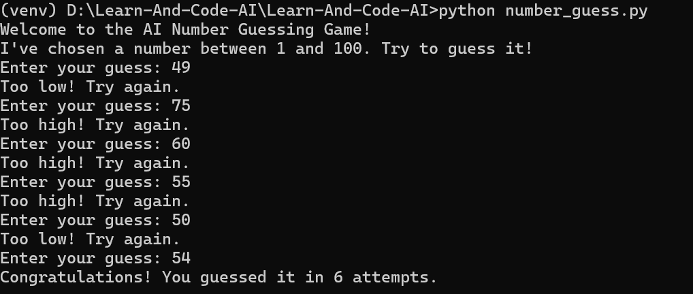
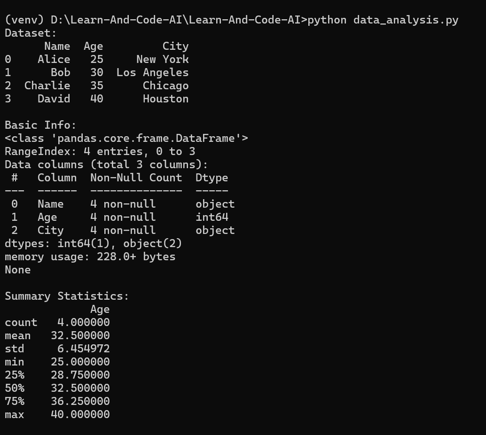
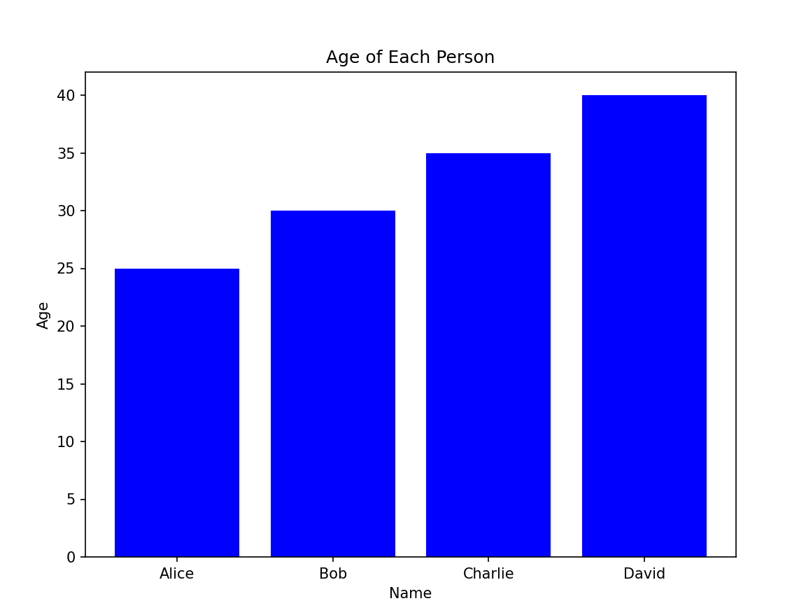

# Week 1 - AI & Python Basics

## Objective
In **Week 1**, we focus on learning the foundational concepts of **Python programming**, including variables, loops, functions, and data structures. We will also start exploring data analysis and visualization using the **Pandas** and **Matplotlib** libraries. The aim is to build a strong base in Python, which will be essential as we progress into more complex AI topics in future weeks.

---

## Day 1 - Python Basics & Data Science

### 1. Python Basics - Number Guessing Game

#### Objective:
Build a simple **number guessing game** using Python.

#### Key Concepts Covered:
- **Variables**: A variable is a container for storing data values. In Python, you can create variables to store different data types, such as integers, strings, or lists.
- **Functions**: Functions are reusable blocks of code designed to perform a specific task. We define functions using the `def` keyword in Python.
- **User Input**: User input allows us to take information from the user. In Python, we use the `input()` function to get data from the user.
- **Loops**: A loop is used to repeat a block of code multiple times. In our game, we use a loop to keep asking the user for a guess until they get the correct answer.
- **Conditionals**: Conditionals allow us to make decisions in code. We use `if`, `elif`, and `else` to execute certain blocks of code based on conditions.

#### Code Example:
```python
import random

# Generate a random number between 1 and 100
number = random.randint(1, 100)

# Take user input
guess = int(input("Guess the number between 1 and 100: "))

# Repeat until the guess is correct
while guess != number:
    if guess < number:
        print("Too low!")
    elif guess > number:
        print("Too high!")
    guess = int(input("Guess again: "))

print("Congratulations, you guessed it!")
```
### Output 


### 2. Data Analysis with Pandas

#### Objective:
Learn how to create and manipulate datasets using **Pandas**, a powerful Python library for data analysis.

#### Key Concepts Covered:
- **DataFrame**: A DataFrame is a 2-dimensional labeled data structure in Pandas. It’s like a table with rows and columns where we can store and manipulate data. It’s one of the most common structures used in data analysis with Pandas.
  
- **Adding New Columns**: In Pandas, new columns can be added to a DataFrame by assigning values to new column names. This is useful for manipulating or adding calculated data to the dataset.
  
- **Filtering Data**: Filtering allows us to select data based on specific conditions. For example, we can filter out rows where the age of people is greater than 25.
  
- **Sorting Data**: Sorting allows us to reorder the data in a DataFrame based on a particular column, either in ascending or descending order.
  
- **Summarizing Data**: The `describe()` method in Pandas provides a summary of the statistics of numerical columns in a DataFrame. It includes metrics like mean, standard deviation, minimum, and maximum values.
  
- **Getting Information About Data**: The `info()` method provides basic information about a DataFrame such as the number of rows, column names, and data types of the columns.

#### Code Example:

```python
import pandas as pd

# Create a simple DataFrame
data = {"Name": ["Alice", "Bob", "Charlie"], "Age": [25, 30, 35]}
df = pd.DataFrame(data)

# Add a new column 'Salary'
df["Salary"] = [50000, 60000, 70000]

# Filter rows where Age is greater than 25
df_filtered = df[df["Age"] > 25]

# Display summary statistics for numerical columns
print(df.describe())

# Display detailed information about the DataFrame
print(df.info())
```

### Output




### 3. Data Visualization with Matplotlib

#### Objective:
Learn how to visualize data using simple plots with **Matplotlib**, a popular Python plotting library.

#### Key Concepts Covered:
- **Plotting**: Plotting is the process of creating visual representations of data. In Matplotlib, we use functions like `plt.bar()` or `plt.plot()` to create plots. These visualizations help us understand patterns and trends in data more easily.
  
- **Customizing Plots**: Customizing plots means adding labels, titles, and other elements to improve readability. We can set the x and y axis labels, add a title, and more to make the plot clearer and more informative.
  
- **Types of Plots**: Matplotlib supports a variety of plots like line plots, bar plots, histograms, scatter plots, and more. For this exercise, we focus on creating a **bar plot** to visualize data.

#### Code Example:

```python
import matplotlib.pyplot as plt
import pandas as pd

# Create a simple DataFrame
data = {"Name": ["Alice", "Bob", "Charlie"], "Age": [25, 30, 35]}
df = pd.DataFrame(data)

# Create a bar plot
plt.bar(df["Name"], df["Age"])

# Add labels and title
plt.xlabel('Name')
plt.ylabel('Age')
plt.title('Age of People')

# Display the plot
plt.show()
```
### Output

