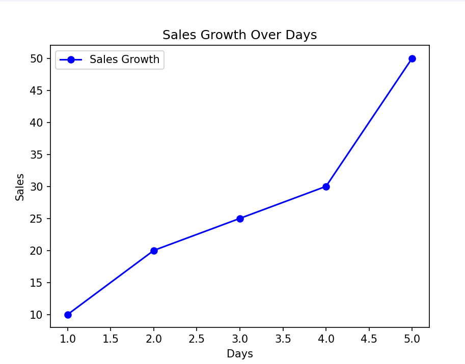

# Week 1 - AI & Python Basics

## Objective
In **Week 1**, we focus on learning the foundational concepts of **Python programming**, including variables, loops, functions, and data structures. We will also start exploring data analysis and visualization using the **Pandas** and **Matplotlib** libraries. The aim is to build a strong base in Python, which will be essential as we progress into more complex AI topics in future weeks.

---

## Day 1 - Python Basics & Data Science

### 1. Python Basics - Number Guessing Game

#### Objective:
Build a simple **number guessing game** using Python.

#### Key Concepts Covered:
- **Variables**: A variable is a container for storing data values. In Python, you can create variables to store different data types, such as integers, strings, or lists.
- **Functions**: Functions are reusable blocks of code designed to perform a specific task. We define functions using the `def` keyword in Python.
- **User Input**: User input allows us to take information from the user. In Python, we use the `input()` function to get data from the user.
- **Loops**: A loop is used to repeat a block of code multiple times. In our game, we use a loop to keep asking the user for a guess until they get the correct answer.
- **Conditionals**: Conditionals allow us to make decisions in code. We use `if`, `elif`, and `else` to execute certain blocks of code based on conditions.

#### Code Example:
```python
import random

# Generate a random number between 1 and 100
number = random.randint(1, 100)

# Take user input
guess = int(input("Guess the number between 1 and 100: "))

# Repeat until the guess is correct
while guess != number:
    if guess < number:
        print("Too low!")
    elif guess > number:
        print("Too high!")
    guess = int(input("Guess again: "))

print("Congratulations, you guessed it!")
```
### Output 


### 2. Data Analysis with Pandas

#### Objective:
Learn how to create and manipulate datasets using **Pandas**, a powerful Python library for data analysis.

#### Key Concepts Covered:
- **DataFrame**: A DataFrame is a 2-dimensional labeled data structure in Pandas. It’s like a table with rows and columns where we can store and manipulate data. It’s one of the most common structures used in data analysis with Pandas.
  
- **Adding New Columns**: In Pandas, new columns can be added to a DataFrame by assigning values to new column names. This is useful for manipulating or adding calculated data to the dataset.
  
- **Filtering Data**: Filtering allows us to select data based on specific conditions. For example, we can filter out rows where the age of people is greater than 25.
  
- **Sorting Data**: Sorting allows us to reorder the data in a DataFrame based on a particular column, either in ascending or descending order.
  
- **Summarizing Data**: The `describe()` method in Pandas provides a summary of the statistics of numerical columns in a DataFrame. It includes metrics like mean, standard deviation, minimum, and maximum values.
  
- **Getting Information About Data**: The `info()` method provides basic information about a DataFrame such as the number of rows, column names, and data types of the columns.

#### Code Example:

```python
import pandas as pd

# Create a simple DataFrame
data = {"Name": ["Alice", "Bob", "Charlie"], "Age": [25, 30, 35]}
df = pd.DataFrame(data)

# Add a new column 'Salary'
df["Salary"] = [50000, 60000, 70000]

# Filter rows where Age is greater than 25
df_filtered = df[df["Age"] > 25]

# Display summary statistics for numerical columns
print(df.describe())

# Display detailed information about the DataFrame
print(df.info())
```

### Output


### 3. Data Visualization with Matplotlib

#### Objective:
Learn how to visualize data using simple plots with **Matplotlib**, a popular Python plotting library.

#### Key Concepts Covered:
- **Plotting**: Plotting is the process of creating visual representations of data. In Matplotlib, we use functions like `plt.bar()` or `plt.plot()` to create plots. These visualizations help us understand patterns and trends in data more easily.
  
- **Customizing Plots**: Customizing plots means adding labels, titles, and other elements to improve readability. We can set the x and y axis labels, add a title, and more to make the plot clearer and more informative.
  
- **Types of Plots**: Matplotlib supports a variety of plots like line plots, bar plots, histograms, scatter plots, and more. For this exercise, we focus on creating a **bar plot** to visualize data.

#### Code Example:

```python
import matplotlib.pyplot as plt
import pandas as pd

# Create a simple DataFrame
data = {"Name": ["Alice", "Bob", "Charlie"], "Age": [25, 30, 35]}
df = pd.DataFrame(data)

# Create a bar plot
plt.bar(df["Name"], df["Age"])

# Add labels and title
plt.xlabel('Name')
plt.ylabel('Age')
plt.title('Age of People')

# Display the plot
plt.show()
```
### Output


# Day 2 – Python Basics and Object-Oriented Programming (OOP)

## Objective
Today, we focused on the **basics of Python programming**, including data structures like **lists**, **tuples**, **dictionaries**, and **sets**, as well as learning about **Object-Oriented Programming (OOP)** concepts such as **encapsulation**, **inheritance**, and **polymorphism**.

---

### 1. Python Data Structures

#### Lists
- Lists are ordered collections that can hold items of different data types. They are mutable, meaning their contents can be changed.
  
#### Tuples
- Tuples are similar to lists but are **immutable**, meaning once defined, their contents cannot be changed.

#### Dictionaries
- Dictionaries are unordered collections of key-value pairs. The keys are unique, and they are used to store and retrieve values.

#### Sets
- Sets are unordered collections that only contain unique items. They are used to store elements without duplication.

---

### 2. Object-Oriented Programming (OOP) in Python

#### Classes and Objects
- **Class**: A blueprint for creating objects. 
- **Object**: An instance of a class.

#### Encapsulation
- It is the bundling of data and methods that operate on that data within a class. We use **private variables** (prefix with underscore) to hide details.

#### Inheritance
- Inheritance allows a class to inherit properties and methods from another class (parent class). The child class can override the inherited methods.

#### Polymorphism
- Polymorphism allows objects of different classes to be treated as objects of a common base class. It also refers to the ability to override methods in child classes.


## Day 3 - Understanding AI Concepts & Machine Learning Algorithms

## Objective

Today, we explored fundamental AI concepts and different types of machine learning algorithms. Understanding these concepts is crucial as they form the foundation for building AI models.

### 1. Introduction to AI Concepts

**What is Artificial Intelligence?**

Artificial Intelligence (AI) is the simulation of human intelligence in machines that can perform tasks such as learning, reasoning, problem-solving, perception, and language understanding.

**Key AI Concepts**:

**Machine Learning (ML)**: A subset of AI that enables machines to learn patterns from data.

**Deep Learning (DL)**: A subset of ML using neural networks with multiple layers to model complex patterns.

**Natural Language Processing (NLP)**: Enables machines to understand and generate human language.

**Computer Vision**: Allows machines to interpret and process images and videos.

### 2. Types of Machine Learning Algorithms

Machine learning can be categorized into three main types:

#### 1. Supervised Learning

The model learns from labeled data.

Example algorithms:

##### Linear Regression

**What it does**:

Used for predicting continuous values (e.g., house prices, stock prices).
Finds the best-fit line between input (X) and output (Y).
**How it works**:

The equation of a line: **Y = mX + b**
The algorithm finds the best values for m (slope) and b (intercept) that minimize errors.
📌 Example: Predict house prices based on square footage.


##### Logistic Regression

**What it does**:

Used for binary classification (e.g., Spam or Not Spam, Disease or No Disease).
Instead of predicting a number, it predicts probabilities between 0 and 1.
**How it works**:

Uses the sigmoid function to map outputs between 0 and 1.
If probability > 0.5 → Class 1
If probability < 0.5 → Class 0
📌 Example: Predict whether a student will pass an exam based on study hours.


##### Decision Trees
**What it does**:

Works like a flowchart: "If X happens, then do Y"
Used for both classification and regression problems.
**How it works**:

Splits the dataset into smaller groups based on feature importance.
Each node represents a decision rule, and leaves represent predictions.
📌 Example: Classify whether an email is spam based on words it contains.


**Random Forest**

**Support Vector Machines (SVM)**

**Neural Networks**

#### 2. Unsupervised Learning

The model finds patterns in unlabeled data.

Example algorithms:

##### K-Means Clustering :
**What it does**:

Unsupervised learning algorithm for grouping data into clusters.
Used in customer segmentation, anomaly detection, etc.
**How it works**:

Selects K cluster centers randomly.
Assigns each data point to the nearest cluster.
Updates cluster centers and repeats until convergence.
📌 Example: Group customers based on shopping behavior.

**Hierarchical Clustering**

**Principal Component Analysis (PCA)**

**Autoencoders**

#### 3. Reinforcement Learning

The model learns by interacting with an environment and receiving rewards or penalties.

Example algorithms:

##### Q-Learning :

**What it does**:

Reinforcement Learning algorithm where an agent learns by interacting with an environment.
Used in **game AI, robotics, self-driving cars**.
**How it works**:

The AI takes actions, receives rewards, and updates its Q-values.
It learns the best actions over time to maximize rewards.
📌 Example: AI learns to play a simple grid-based game.


**Deep Q Networks (DQN)**

**Policy Gradient Methods**

### 3. How Does ChatGPT Learn?

**Supervised Learning**: Trained on labeled data to learn language patterns.

**Reinforcement Learning with Human Feedback (RLHF)**: Fine-tuned using feedback from human reviewers to improve response quality.

**Neural Networks**: Uses deep learning architectures (Transformers) to generate responses.


# Day 4 - Data Preprocessing in AI & Building Our First AI Model

## Objective 
In this session, we learnt about **Feature engineering** and its techniques with hands-on **Data Preprocessing** and explored how to train a basic Machine Learning model using `scikit-learn`. We covered data preprocessing, model training, evaluation, and interpretation of results.

#### Feature Engineering

Feature Engineering is a crucial step in AI that improves model performance by selecting and transforming the right features.
Some common techniques:

- **Scaling**: Normalizing numerical data.
- **Encoding**: Converting categorical data into numerical form.
- **Feature Selection**: Choosing the most important features for training.

### Hands-on: Data Preprocessing in AI

- **Load a dataset**.
- **Handle missing values**.
- **Convert categorical variables**.
- **Scale numerical data.**

The key steps include:

1. Standardization using **StandardScaler**
2. One-Hot Encoding using **OneHotEncoder**

**StandardScaler**: Used for feature scaling (normalizing numerical values) - scales & transforms data so that:
**Mean = 0**
**Standard deviation = 1**
\`
Standardized Value = Original Value − Mean / Standard Deviation
​\`

**OneHotEncoder**: Converts categorical values into numerical format / binary format.
**numpy & pandas**: Used for numerical computations and data handling.

###  Feature Scaling and Normalization
Feature scaling is important in AI because different features can have vastly different ranges. If not scaled, some features may dominate over others, affecting the performance of AI models.

#### 1. Standardization (Z-score normalization)
Standardization transforms data so that it has a mean of 0 and a standard deviation of 1. It is useful when data follows a normal distribution.

📌 Formula:
​\`
𝑋_scaled = 𝑋 − 𝜇 / 𝜎
where μ = mean, and σ = standard deviation.
​\`

#### 2. Min-Max Scaling (Normalization)
Min-Max Scaling scales data to a fixed range, usually [0,1]. It is useful when data does not follow a normal distribution.

📌 Formula:
​\`
𝑋scaled = 𝑋 − 𝑋𝑚𝑖𝑛 / 𝑋𝑚𝑎𝑥 − 𝑋𝑚𝑖𝑛
​\`

📌 When to Use What?
✅ Use Standardization (Z-score normalization) when:

Data follows a normal distribution (e.g., heights, weights, test scores).
You are using models like Linear Regression, Logistic Regression, SVM, PCA that assume normally distributed data.

✅ Use Min-Max Scaling when:

Data does not follow a normal distribution.
You are using Neural Networks, KNN, Decision Trees, which perform better with normalized values.

​
### Data Visualization in Python 📊
Data visualization helps understand patterns, relationships, and insights in data. We use libraries like Matplotlib and Seaborn for this.

#### 1.Matplotlib - Basic Plotting
Matplotlib is the most widely used visualization library. It allows us to create line plots, bar charts, histograms, scatter plots, etc.

**​Example: Line Plot**
 

#### 2.Seaborn - Statistical Visualization
Seaborn is built on top of Matplotlib and provides better aesthetics and easy-to-use statistical plots like box plots, violin plots, heatmaps, etc.

**Example: Histogram (Data Distribution)**


#### 3.Scatter Plot (Comparing Two Variables)
Scatter plots help see the relationship between two variables.


### Feature Engineering in AI & Machine Learning

Feature engineering is the process of transforming raw data into useful features that improve model performance. It includes:
✔ Handling missing values
✔ Creating new features
✔ Encoding categorical data
✔ Scaling numerical data

#### 1.Handling Missing Data
Missing data can affect model accuracy. We handle it using:

- Dropping missing values
- Filling missing values (Imputation)

 #### 2.Creating New Features
Sometimes, we create new features to capture more information from the data.

#### 3.Encoding Categorical Data
Machine learning models need numerical data, so we convert categorical variables into numbers.

#### 4.Scaling Numerical Data
Scaling ensures that all numerical features have the same range, making models more stable.

### Building Our First AI Model

#### Step 1: Understanding the ML Pipeline

- **Collect Data** → Get the dataset (CSV, API, etc.).
- **Preprocess Data** → Handle missing values, encode categorical variables.
- **Split Data** → Divide into training and testing sets.
- **Choose Model** → Select a model (e.g., Linear Regression, Decision Trees, etc.).
- **Train Model** → Fit the model using training data.
- **Evaluate Model** → Test it on unseen data and analyze results.
- **Improve & Tune** → Optimize hyperparameters for better accuracy.

#### Step 2: Choosing a Dataset
We'll use Iris dataset from sklearn.datasets.
It’s a simple classification dataset with features like petal length, petal width, etc., and the target is the species of the flower.

#### Step 3: Train-Test Split
We'll use train_test_split to split data into 80% training and 20% testing.

#### Step 4: Training a Logistic Regression Model
We'll implement Logistic Regression, a basic classification algorithm, and train it on the dataset.

#### Step 5: Evaluating Performance
We'll check accuracy, confusion matrix, and classification report.

## Code Snippet
```python
from sklearn.model_selection import train_test_split
from sklearn.preprocessing import StandardScaler, OneHotEncoder
from sklearn.impute import SimpleImputer
from sklearn.linear_model import LogisticRegression
from sklearn.metrics import accuracy_score, confusion_matrix, classification_report
import numpy as np
import pandas as pd

# Example dataset
data = {
    'Feature1': [1, 2, np.nan, 4, 5],
    'Feature2': ['A', 'B', 'A', 'B', 'A'],
    'Target': [0, 1, 0, 1, 0]
}

df = pd.DataFrame(data)

# Handling missing values
imputer = SimpleImputer(strategy='mean')
df[['Feature1']] = imputer.fit_transform(df[['Feature1']])

# Encoding categorical data
encoder = OneHotEncoder(sparse_output=False, drop='first')
encoded_features = encoder.fit_transform(df[['Feature2']])
df = df.drop(columns=['Feature2'])
df[['Feature2_B']] = encoded_features

# Splitting data
X = df.drop(columns=['Target'])
y = df['Target']
X_train, X_test, y_train, y_test = train_test_split(X, y, test_size=0.2, random_state=42)

# Feature scaling
scaler = StandardScaler()
X_train = scaler.fit_transform(X_train)
X_test = scaler.transform(X_test)

# Model training
model = LogisticRegression()
model.fit(X_train, y_train)

# Predictions
y_pred = model.predict(X_test)

# Evaluation
accuracy = accuracy_score(y_test, y_pred)
conf_matrix = confusion_matrix(y_test, y_pred)
report = classification_report(y_test, y_pred)

print(f"Model Accuracy: {accuracy:.2f}")
print("
Confusion Matrix:")
print(conf_matrix)
print("
Classification Report:")
print(report)
```

#### Step 6: Interpreting Results
- **Accuracy Score** → Tells how well the model performs overall.
- **Confusion Matrix** → Shows true positives, false positives, etc.
- **Classification Report** → Precision, recall, and F1-score.

Your output consists of three key evaluation metrics for your classification model:

1. **Model Accuracy**
Formula:
**Accuracy = Correct Predictions / Total Predictions**

It represents the percentage of correctly classified samples.
Example: If accuracy is 0.92, the model correctly predicts 92% of the cases.

2. **Confusion Matrix**
A table that shows how well the model distinguishes between classes.

Format:
[[TP  FN]
 [FP  TN]]
TP (True Positive): Correctly predicted positive cases.
FN (False Negative): Missed positive cases (predicted as negative).
FP (False Positive): Incorrectly predicted positive cases.
TN (True Negative): Correctly predicted negative cases.

3. **Classification Report**
Gives a detailed breakdown of model performance per class.

Includes:
**Precision**: Out of all predicted positives, how many are actually positive?
\` Precision= TP / FP + TP \`
​
**Recall (Sensitivity)**: Out of all actual positives, how many were correctly predicted?
\` Recall= TP / FN + TP \'
​
**F1-Score**: A balance between precision and recall.
F1-Score = 2× (Precision x Recall / Precision + Recall)
​
**Support**: The number of instances for each class in the dataset.

## Key Takeaways
- Data preprocessing is essential before feeding data into an ML model.
- Logistic Regression is a basic classification algorithm that works well for binary classification.
- The confusion matrix and classification report provide insights into model performance.


