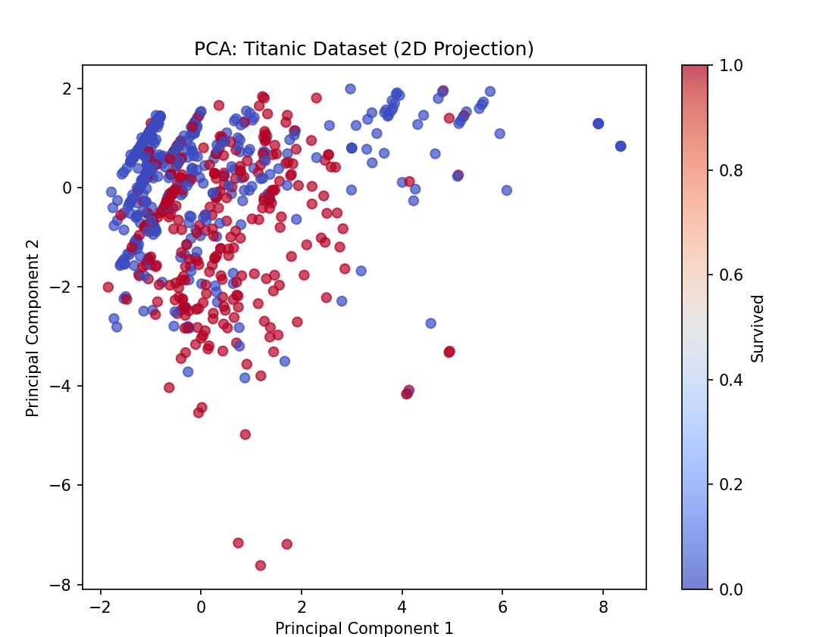
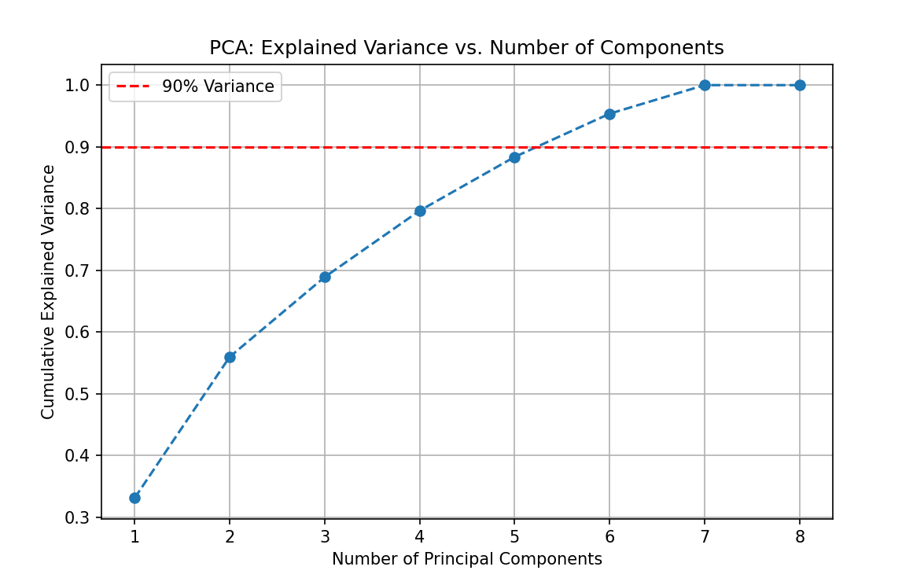
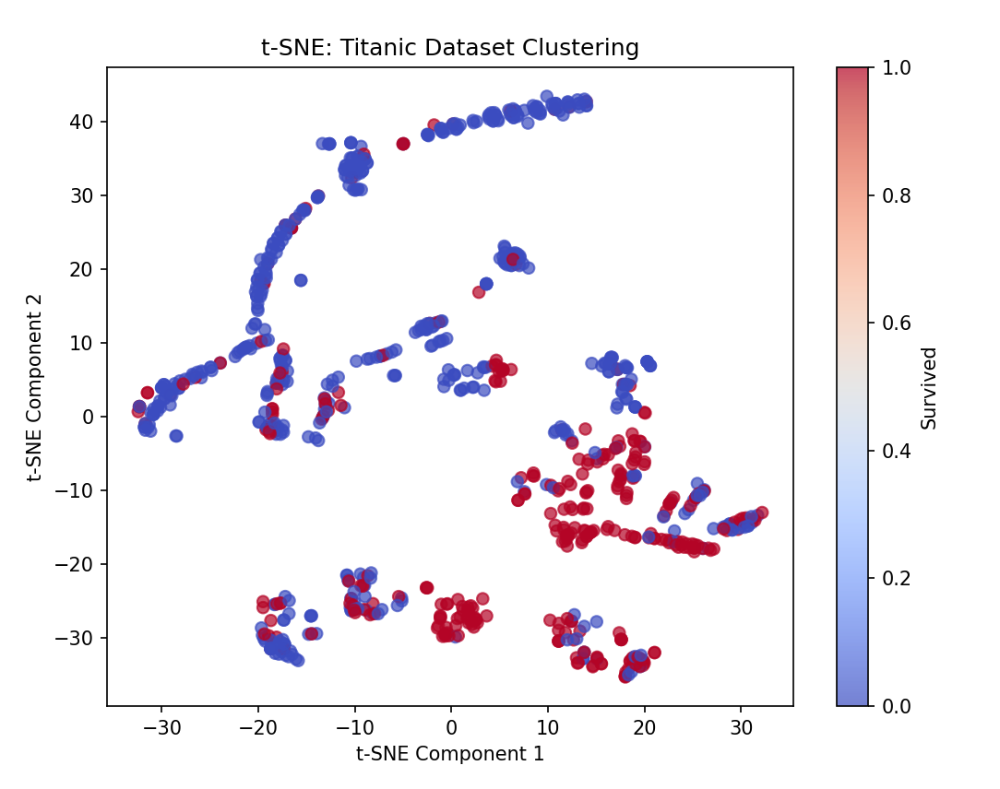
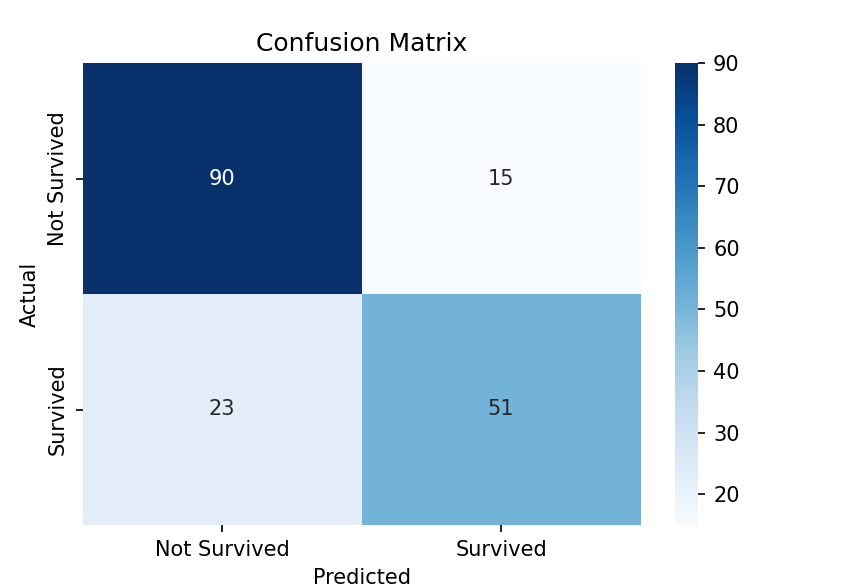
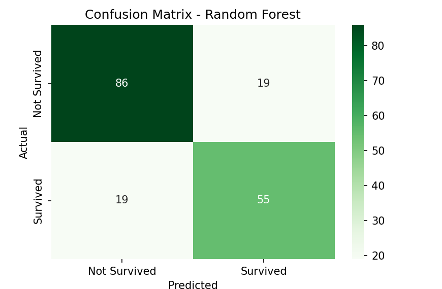
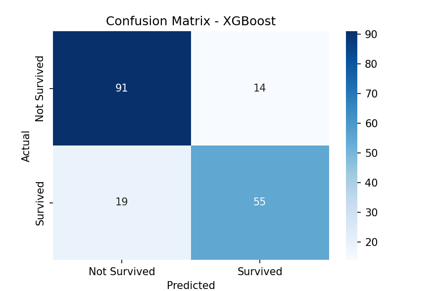

# Week2 

## Day 1 - Feature Engineering, Dimensionality Reduction & Introduction to Neural Networks

### Objective
Today, we focused on the **Feature Engineering & Dimensionality Reduction** which includes Feature extraction using PCA, LDA or t-SNE and Handling imbalanced data (SMOTE, class weighting).Next we will learn about **Neural Networks** which includes **Understanding perceptrons & multi-layer networks**,Implementing **forward & backward propagation** and then Coding a simple Neural Network from scratch (before using TensorFlow/PyTorch).

#### Feature Engineering & Dimensionality Reduction
Before starting, let's learn about PCA & t-SNE.

##### Overview of PCA & t-SNE

1. **Principal Component Analysis (PCA)** – Linear Dimensionality Reduction
PCA is a technique used to reduce the number of features (dimensions) in a dataset while preserving the most important information.

 **How it works**:

- Finds the directions (principal components) that maximize variance in the data.
- Projects data onto these components to reduce dimensionality.

 **Why use PCA?**

- Removes redundant features
- Speeds up training by reducing feature space
- Helps with visualization (reducing data to 2D or 3D)

**When to use PCA?**

- When you have many correlated features
- When you want to speed up training for ML models

2. **t-SNE (t-Distributed Stochastic Neighbor Embedding)** – Nonlinear Dimensionality Reduction
t-SNE is mainly used for visualizing high-dimensional data in 2D or 3D. Unlike PCA, it preserves the local structure of the data, making it great for clustering.

**How it works:**

- Converts high-dimensional distances into probabilities
- Maps data points to a lower-dimensional space (2D or 3D)
- Ensures that similar points stay close together

**Why use t-SNE?**

- Great for visualizing clusters
- Captures nonlinear relationships better than PCA

**When to use t-SNE?**

- When you want to understand patterns in data
- When PCA isn’t preserving enough structure

Let's start with Step 1: Preprocessing the Titanic dataset before applying PCA and t-SNE.

**Step 1: Feature Engineering on Titanic Dataset**
- Load the dataset and check for missing values
- Encode categorical features (e.g., Sex, Embarked)
- Create new features (e.g., Family Size = SibSp + Parch)
- Apply PCA or t-SNE for dimensionality reduction
- Handle class imbalance if needed

📌 Task: Transform Titanic data into a feature-rich, ML-ready format and visualize PCA/t-SNE results.

**Step 2: Apply PCA (Principal Component Analysis)**
Now that our Titanic dataset is preprocessed, let’s:
- Apply PCA to reduce the number of features.
- Visualize how much variance is retained.
- Plot the first two principal components in 2D.

Since PCA with 2 components explains only 55% of the variance, we might need more components to retain more information.

📌 Adjusting PCA: **Find Optimal Number of Components**
Let’s check how many components explain at least 90% of the variance.

**Output** : Optimal number of components to retain 90% variance: 6

- A line plot showing how variance increases with more components.
- The optimal number of components for at least 90% variance.

Once we find the best number of components, we’ll:
- Apply PCA with that number of components.
- Then, apply t-SNE for better clustering visualization

**Step 1: Apply PCA with 6 Components**

Total Variance Retained with 6 Components: **95.37%**

**Step 2: Apply t-SNE for Visualization**

Since PCA is linear, we’ll now apply t-SNE, which captures nonlinear patterns & clusters better.

**Observations from Your Plot:**
1. Two distinct clusters can be seen.

- The red dots (Survived = 1) are concentrated in specific areas.
- The blue dots (Survived = 0) are more widespread.

2. Some overlap exists between survivors and non-survivors.

This suggests that some passengers had similar features but different survival outcomes.

3. Better separation of clusters means survival was predictable

- If we see clear, distinct groups, survival depended strongly on features like class, age, gender, etc.
- If there is too much overlap, survival might involve complex, hidden factors.

**Step 3: Train a Classification Model (Survival Prediction)**
Now, let’s build a machine learning model to predict Survived (0 or 1) based on the Titanic dataset.

**Choose a Model**
We'll start with Logistic Regression (a simple model) and then try Random Forest (a more powerful model).

**Train a Logistic Regression Model**

**Step 4: Train a Random Forest Classifier**
Random Forest is an ensemble learning method that uses multiple decision trees to improve accuracy.

Your accuracy didn't improve, but the confusion matrix shifted slightly:

- More survivors were correctly classified (51 → 55).
- Slight decrease in non-survivor correct classification (90 → 86).

This suggests that Random Forest is slightly better at identifying survivors but doesn't significantly improve overall accuracy.

##### Next Steps for Improvement

**Hyperparameter Tuning for Random Forest**
Instead of using default settings, we can fine-tune the number of trees, depth, and splits to improve performance.

**Tuned Random Forest Accuracy: 83.24%** 🚀

Your best parameters:
- max_depth=5
- min_samples_leaf=1
- min_samples_split=2
- n_estimators=200

This means:
- A deeper tree (max_depth=5) is helping capture patterns better.
- More estimators (200 trees) improve the model's robustness.

**Step 5: Train XGBoost for Better Accuracy**
XGBoost is a powerful gradient boosting model that often outperforms Random Forest.

Your XGBoost model is working, and you've achieved an accuracy of 81.56%. 

Best Parameters Found:
{
    'subsample': 0.8,
    'n_estimators': 300,
    'min_child_weight': 5,
    'max_depth': 3,
    'learning_rate': 0.01
}

**Final XGBoost Accuracy: 83.24%**

##### Advanced Hyperparameter Tuning with Bayesian Optimization
Since Random Search and Grid Search explore a fixed number of combinations, they may miss better hyperparameters. Instead, we’ll use **Bayesian Optimization with Optuna**, which intelligently chooses the best parameters by learning from previous results.

- Best Parameters:
{
    "n_estimators": 321,
    "max_depth": 10,
    "learning_rate": 0.0104,
    "min_child_weight": 6,
    "subsample": 0.688,
    "colsample_bytree": 0.666
}
- Best Accuracy from Optuna: 81.59%

**Final XGBoost Accuracy after Bayesian Optimization: 82.68%**
